# Gonzo LangGraph Architecture

This document outlines the core architecture of the Gonzo LangGraph system.

## System Overview

```mermaid
graph TB
    %% Core Components
    Gonzo[Gonzo Agent] --> KnowledgeGraph
    Gonzo --> EvolutionSystem
    Gonzo --> ResponseSystem
    
    %% Knowledge Graph Components
    KnowledgeGraph[Knowledge Graph] --> AssessmentFlow
    KnowledgeGraph --> NarrativeFlow
    KnowledgeGraph --> PatternDetection
    
    %% Assessment Flow
    AssessmentFlow --> ContentAnalysis
    AssessmentFlow --> EntityExtraction
    AssessmentFlow --> SentimentAnalysis
    
    %% Narrative Flow
    NarrativeFlow --> ContextBuilder
    NarrativeFlow --> StoryConstruction
    NarrativeFlow --> ThemeAnalysis
    
    %% Evolution System
    EvolutionSystem --> StateManager
    EvolutionSystem --> AdaptiveLogic
    EvolutionSystem --> MemorySystem
    
    %% Response System
    ResponseSystem --> OpenAIAgent
    ResponseSystem --> XClient
    ResponseSystem --> ContentGenerator
    
    %% X Integration
    XClient --> DirectAPI[Direct X API]
    XClient --> OpenAPIAgent[OpenAPI Agent]
    XClient --> RateLimiter
    
    %% Integrations
    subgraph Integrations
        DirectAPI
        OpenAPIAgent
        YouTube[YouTube API]
    end
    
    %% Memory and State
    subgraph State Management
        StateManager
        MemorySystem
        PatternDetection
    end
    
    %% Content Processing
    subgraph Content Processing
        ContentAnalysis
        EntityExtraction
        SentimentAnalysis
        ContentGenerator
    end
    
    %% Style Definitions
    classDef primary fill:#2374ab,stroke:#2374ab,stroke-width:2px,color:#fff
    classDef secondary fill:#048ba8,stroke:#048ba8,stroke-width:2px,color:#fff
    classDef tertiary fill:#0db39e,stroke:#0db39e,stroke-width:2px,color:#fff
    classDef integration fill:#16db93,stroke:#16db93,stroke-width:2px,color:#fff
    classDef state fill:#83e377,stroke:#83e377,stroke-width:2px,color:#fff
    classDef processing fill:#b9e769,stroke:#b9e769,stroke-width:2px,color:#fff
    
    %% Apply Styles
    class Gonzo,KnowledgeGraph,EvolutionSystem,ResponseSystem primary
    class AssessmentFlow,NarrativeFlow,XClient secondary
    class StateManager,MemorySystem,ContentGenerator tertiary
    class DirectAPI,OpenAPIAgent,YouTube integration
    class StateManager,MemorySystem,PatternDetection state
    class ContentAnalysis,EntityExtraction,SentimentAnalysis,ContentGenerator processing
```

## Component Descriptions

### Core Components

1. **Gonzo Agent**: Central orchestrator that coordinates all system activities and maintains the core logic of Gonzo's persona.

2. **Knowledge Graph**: Processes and stores information, maintaining relationships between different pieces of data.

3. **Evolution System**: Handles adaptation and learning, allowing Gonzo to evolve over time.

4. **Response System**: Generates and manages all system outputs.

### X Integration

The X (Twitter) integration provides dual-mode operation:
- Direct API access for standard operations
- OpenAPI Agent for complex interactions
- Built-in rate limiting and state management

### Knowledge Processing

1. **Assessment Flow**:
   - Content Analysis
   - Entity Extraction
   - Sentiment Analysis

2. **Narrative Flow**:
   - Context Building
   - Story Construction
   - Theme Analysis

3. **Pattern Detection**:
   - Trend Analysis
   - Correlation Detection
   - Anomaly Identification

### State Management

1. **State Manager**: Maintains system state and configuration
2. **Memory System**: Retains context and historical information
3. **Adaptive Logic**: Modifies behavior based on learning and experience
