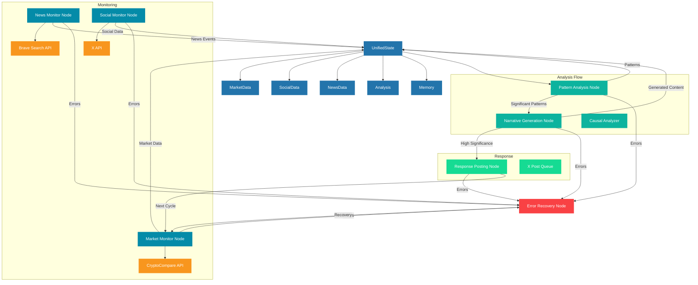

# Updated Gonzo Architecture

## Workflow Stages

1. **Market Monitoring**
   - Fetches current crypto market data
   - Detects significant price movements
   - Updates state with market events

2. **News Monitoring** (Every 5 cycles)
   - Searches for relevant crypto news
   - Focuses on whale movements and manipulation
   - Updates state with significant news events

3. **Social Monitoring**
   - Monitors X for relevant discussions
   - Handles rate limiting
   - Tracks influencer activity

4. **Pattern Analysis**
   - Analyzes market, news, and social data
   - Detects significant patterns
   - Identifies correlations

5. **Narrative Generation**
   - Generates Gonzo's perspective
   - Creates thread suggestions
   - Determines response significance

6. **Response Posting**
   - Posts high-significance narratives
   - Manages X API interactions
   - Updates state with post status

7. **Error Recovery**
   - Handles component failures
   - Logs errors
   - Attempts graceful recovery